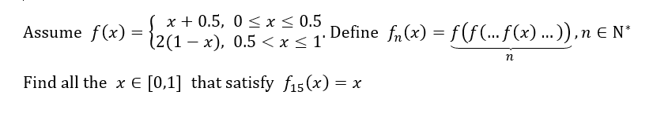

# Fixed-point of a Iterative Function

## Introduction

Solution to a math problem about the fixed-points of a iterative function.

You can clone and run the solution on Visual Studio 2017 (I am not sure whether it works on other versions since it is coded on the 2017 version)

If you are lazy, you can directly download the report in the [Releases](https://github.com/OscarJin/Fixed-point-of-a-Iterative-Function/releases).

## Problem

## Copyright

Author: Jin Jiayi, Zhang Jiache, Cai Qingyuan and Guo Junyu

Algorithms designed by Jin and Guo

Programmed by Jin and Cai

Debugged by Zhang

Special Thanks to Mr. Jiang Wei, our math teacher, who provides us with the basic thoughts

## Contributing

Bug reports and pull requests are welcome on GitHub at https://github.com/OscarJin/Fixed-point-of-a-Iterative-Function. This project is intended to be a safe, welcoming space for collaboration and contributors.